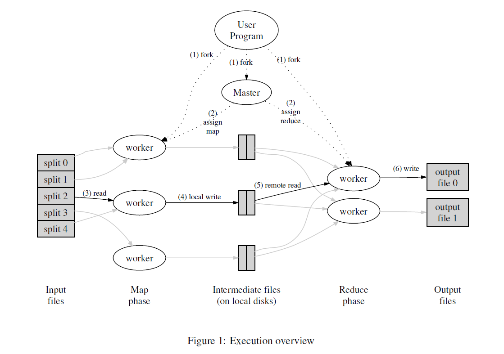

## Abstract

## Introduction

The major contributions of this work are a simple and powerful interface that enables automatic parallelization and distribution of large-scale computations, combined with an implementation of this interface that achieves high performance on large clusters of commodity PCs.

## Programming Model

## Implementation

### Execution Overview

Figure 1 shows the overall flow of a MapReduce operation in our implementation. When the user program

calls the MapReduce function, the following sequence of actions occurs (the numbered labels in Figure 1 correspond to the numbers in the list below):

1. The MapReduce library in the user program first splits the input files into M pieces of typically 16 megabytes to 64 megabytes (MB) per piece (controllable by the user via an optional parameter). It then starts up many copies of the program on a cluster of machines.
2. One of the copies of the program is special – the master. The rest are workers that are assigned work by the master. There are M map tasks and R reduce tasks to assign. The master picks idle workers and assigns each one a map task or a reduce task.
3. A worker who is assigned a map task reads the contents of the corresponding input split. It parses key/value pairs out of the input data and passes each pair to the user-defined Map function. The intermediate key/value pairs produced by the Map function are buffered in memory.
4. Periodically, the buffered pairs are written to local disk, partitioned into R regions by the partitioning function. The locations of these buffered pairs on the local disk are passed back to the master, who is responsible for forwarding these locations to the reduce workers.
5. When a reduce worker is notified by the master about these locations, it uses remote procedure calls to read the buffered data from the local disks of the map workers. When a reduce worker has read all intermediate data, it sorts it by the intermediate keys so that all occurrences of the same key are grouped together. The sorting is needed because typically many different keys map to the same reduce task. If the amount of intermediate data is too large to fit in memory, an external sort is used.
6. The reduce worker iterates over the sorted intermediate data and for each unique intermediate key encountered, it passes the key and the corresponding set of intermediate values to the user’s Reduce function. The output of the Reduce function is appended to a final output file for this reduce partition.
7. When all map tasks and reduce tasks have been completed, the master wakes up the user program. At this point, the MapReduce call in the user program returns back to the user code.

### Master Data Structures

For each map，task and reduce task, it stores the state (idle, in-progress, or completed), and the identity of the worker machine (for non-idle tasks).

### Fault Tolerance

**Worker Failure**

The master pings every worker periodically.

Who needs to be reset to idle and becomes eligible for rescheduling?

- Any map tasks completed (because their output is stored on the local disk(s) of the failed machine and is therefore inaccessible)
- Any map task or reduce task in progress

> Completed reduce tasks do not need to be re-executed since their output is stored in a global file system.

**Master Failure**

It is easy to make the master write periodic checkpoints of the master data structures described above.

**Semantics in the Presence of Failures**

When the user-supplied map and reduce operators are **deterministic** functions of their input values, our distributed implementation produces the same output as would have been produced by a non-faulting sequential execution of the entire program.

We rely on **atomic commits** of map and reduce task outputs to achieve this property.

### Locality

Network bandwidth is a relatively scarce resource in our computing environment. 

We conserve network bandwidth by taking advantage of the fact that the input data (managed by GFS [8]) is stored on the local disks of the machines that make up our cluster.

### Task Granularity

We subdivide the map phase into M pieces and the reduce phase into R pieces, as described above. 

### Backup Tasks

## Refinements

### Partitioning Function

The users of MapReduce specify the number of reduce tasks/output files that they desire (R).

### Ordering Guarantees

This ordering guarantee makes it easy to generate a sorted output file per partition,

### Combiner Function

We allow the user to specify an optional Combiner function that does partial merging of this data before it is sent over the network.

The Combiner function is executed on each machine that performs a map task. 

What is the difference between a reduce function and a combiner function？

The only difference between a reduce function and a combiner function is how the MapReduce library handles the output of the function. 

- The output of a reduce function is written to the final output file. 
- The output of a combiner function is written to an intermediate file that will be sent to a reduce task.

Partial combining significantly speeds up certain classes of MapReduce operations.

### Input and Output Types

The MapReduce library provides support for reading input data in several different formats.

### Side-effects

In some cases, users of MapReduce have found it convenient to produce auxiliary files as additional outputs from their map and/or reduce operators.

We do not provide support for atomic two-phase commits of multiple output files produced by a single task.

### Skipping Bad Records

We provide an optional mode of execution where the MapReduce library detects which records cause deterministic crashes and skips these records in order to make forward progress.

### Local Execution

To help facilitate debugging, profiling, and small-scale testing, we have developed an alternative implementation of the MapReduce library that sequentially executes all of the work for a MapReduce operation on the local machine.

### Status Information

The master runs an internal HTTP server and exports a set of status pages for human consumption.

### Counters

The MapReduce library provides a **counter facility** to count occurrences of various events.

The counter values from individual worker machines are periodically propagated to the master (piggybacked on the ping response). The master aggregates the counter values from successful map and reduce tasks and returns them to the user code when the MapReduce operation is completed.

Users have found the counter facility useful for sanity checking the behavior of MapReduce operations. 

## Performance

In this section we measure the performance of MapReduce on two computations running on a large cluster of machines. One computation searches through approximately one terabyte of data looking for a particular pattern. The other computation sorts approximately one terabyte of data.

## Experience

### Large-Scale Indexing

One of our most significant uses of MapReduce to date has been a complete rewrite of the production indexing system that produces the data structures used for the Google web search service.

## Related Work

> This chapter introduces the related work and makes a comparison between this work and other related work.

Many systems have provided restricted programming models and used the restrictions to parallelize the computation automatically.

More significantly, we provide a fault-tolerant implementation that scales to thousands of processors.

In contrast, most of the parallel processing systems have only been implemented on smaller scales and leave the details of handling machine failures to the programmer.

## Conclusions

The MapReduce programming model has been successfully used at Google for many different purposes.

- First, the model is easy to use, even for programmers without experience with parallel and distributed systems, since it hides the details of parallelization, fault-tolerance, locality optimization, and load balancing. 
- Second, a large variety of problems are easily expressible as MapReduce computations.
- Third, we have developed an implementation of MapReduce that scales to large clusters of machines comprising thousands of machines.

We have learned several things from this work. 

- First, restricting the programming model makes it easy to parallelize and distribute computations and to make such computations fault-tolerant. 
- Second, network bandwidth is a scarce resource.

> A number of optimizations in our system are therefore targeted at reducing the amount of data sent across the network: the locality optimization allows us to read data from local disks, and writing a single copy of the intermediate data to local disk saves network bandwidth.

- Third, redundant execution can be used to reduce the impact of slow machines, and to handle machine failures and data loss.

## Acknowledgements

## References

## References'

1. Video: https://www.youtube.com/watch?v=WtZ7pcRSkOA&feature=youtu.be
2. Lecture Notes: http://nil.csail.mit.edu/6.824/2022/notes/l01.txt
3. Paper: http://nil.csail.mit.edu/6.824/2022/papers/mapreduce.pdf

## Q & A

e.g. Word count

1. Input is already split into M files
2. MR calls Map() for each input file, produces sets of k2, v2 "intermediate" data

> Each Map() call is a "task"

1. When Maps are done, MR gathers all intermediate v2's for a given k2, and passes each key + values to a Reduce call
2. Final output is sets of <k2,v3> pairs from Reduce()s

**MapReduce hides many details**

1. Sending app code to servers
2. Tracking which tasks have finished
3. "shuffling" intermediate data from Maps to Reduces
4. Balancing load over servers
5. Recovering from failures

**However, MapReduce limits what apps can do**

1. No interaction or state (other than via intermediate output).
2. No iteration
3. No real-time or streaming processing.

**Input and output are stored on the GFS cluster file system**

1. MR needs huge parallel input and output throughput.
2. GFS splits files over many servers, in 64 MB chunks
3. Maps read in parallel
4. Reduces write in parallel
5. GFS also replicates each file on 2 or 3 servers
6. GFS is a big win for MapReduce

**Some details (paper's Figure 1)**

one coordinator, that hands out tasks to workers and remembers progress.

1. coordinator gives Map tasks to workers until all Maps complete     Maps write output (intermediate data) to local disk     Maps split output, by hash, into one file per Reduce task
2. After all Maps have finished, coordinator hands out Reduce tasks     each Reduce fetches its intermediate output from (all) Map workers     each Reduce task writes a separate output file on GFS

**What will likely limit the performance?**

In 2004 authors were limited by network capacity. What does MR send over the network?

1. Maps read input from GFS.
2. Reduces read Map intermediate output.
3. Often as large as input, e.g. for sorting.
4. Reduces write output files to GFS.
5. [diagram: servers, tree of network switches]
6. In MR's all-to-all shuffle, half of traffic goes through root switch. Paper's root switch: 100 to 200 gigabits/second, total 1800 machines, so 55 megabits/second/machine. 55 is small:  much less than disk or RAM speed.  Today: networks are much faster

**How does MR minimize network use?**

- Coordinator tries to run each Map task on GFS server that stores its input.

-  All computers run both GFS and MR workers.

-  So input is read from local disk (via GFS), not over network.

Intermediate data goes over network just once. 

Map worker writes to local disk. 

Reduce workers read from Map worker disks over the network. 

Storing it in GFS would require at least two trips over the network. 

Intermediate data partitioned into files holding many keys. 

R is much smaller than the number of keys. 

Big network transfers are more efficient.

**How does MR get good load balance?**

Wasteful and slow if N-1 servers have to wait for 1 slow server to finish.

But some tasks likely take longer than others.

Solution: many more tasks than workers.    Coordinator hands out new tasks to workers who finish previous tasks.    So no task is so big it dominates completion time (hopefully).    So faster servers do more tasks than slower ones, finish abt the same time.

**What about fault tolerance?**

MR re-runs just the failed Map()s and Reduce()s.

- Suppose MR runs a Map twice, one Reduce sees first run's output, another Reduce sees the second run's output?

-  Correctness requires re-execution to yield exactly the same output.

-  So Map and Reduce must be pure deterministic functions: they are only allowed to look at their      arguments/input. no state, no file I/O, no interaction, no external communication.

- What if you wanted to allow non-functional Map or Reduce?

-  Worker failure would require whole job to be re-executed, or you'd need to roll back to some kind of global checkpoint.

**Details of worker crash recovery**

a Map worker crashes:

coordinator notices worker no longer responds to pings

coordinator knows which Map tasks ran on that worker

those tasks' intermediate output is now lost, must be re-created

coordinator tells other workers to run those tasks

can omit re-running if all Reduces have fetched the intermediate data

a Reduce worker crashes:

finished tasks are OK -- stored in GFS, with replicas.

coordinator re-starts worker's unfinished tasks on other workers.

Other failures/problems
  * What if the coordinator gives two workers the same Map() task?
    perhaps the coordinator incorrectly thinks one worker died.
    it will tell Reduce workers about only one of them.
  * What if the coordinator gives two workers the same Reduce() task?
    they will both try to write the same output file on GFS!
    atomic GFS rename prevents mixing; one complete file will be visible.
  * What if a single worker is very slow -- a "straggler"?
    perhaps due to flakey hardware.
    coordinator starts a second copy of last few tasks.
  * What if a worker computes incorrect output, due to broken h/w or s/w?
    too bad! MR assumes "fail-stop" CPUs and software.
  * What if the coordinator crashes?

Current status?
  Hugely influential (Hadoop, Spark, &c).
  Probably no longer in use at Google.
    Replaced by Flume / FlumeJava (see paper by Chambers et al).
    GFS replaced by Colossus (no good description), and BigTable.