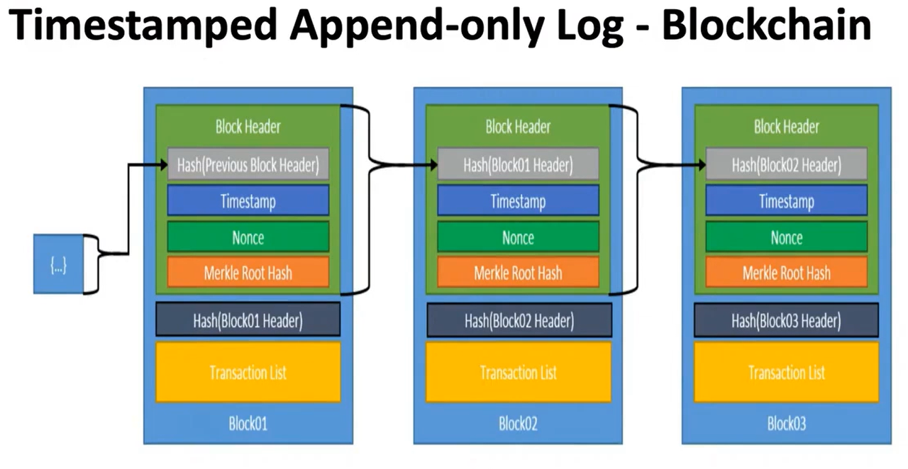
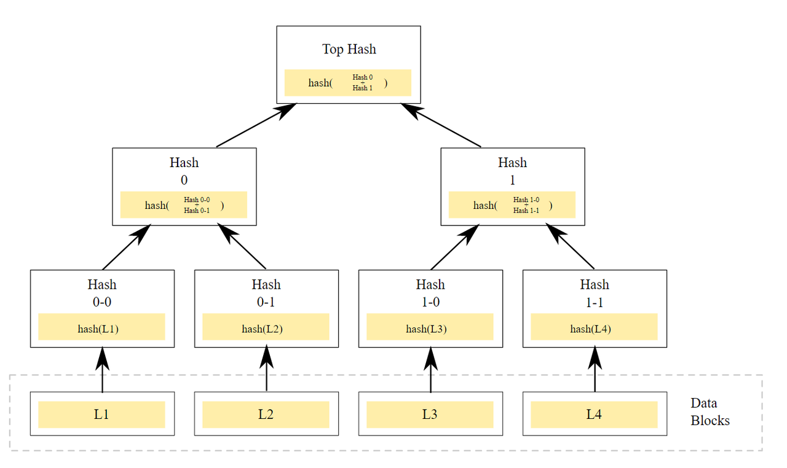
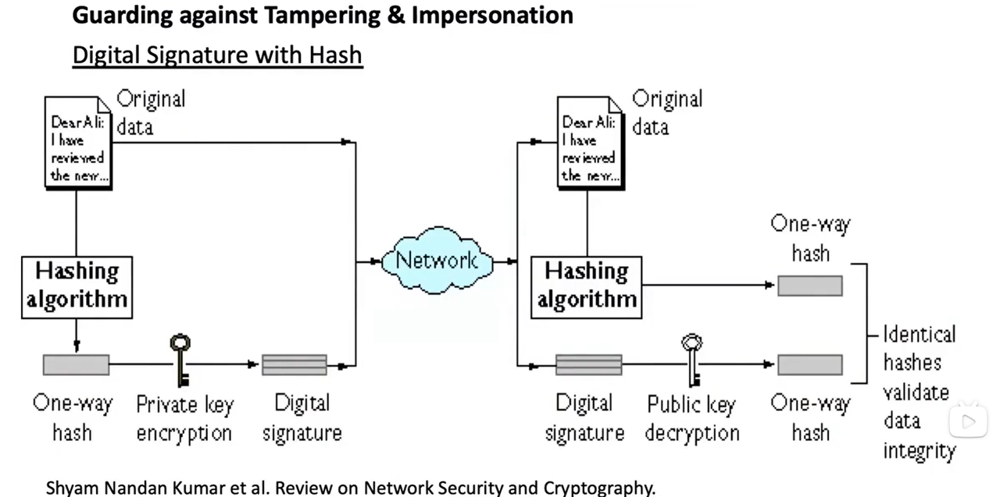
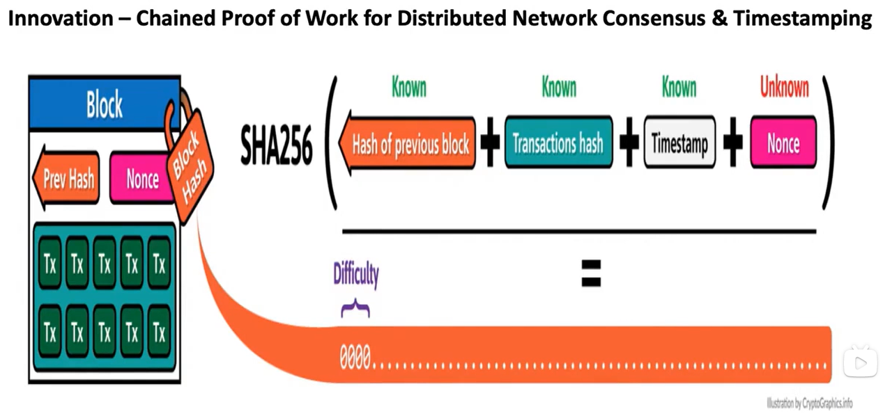
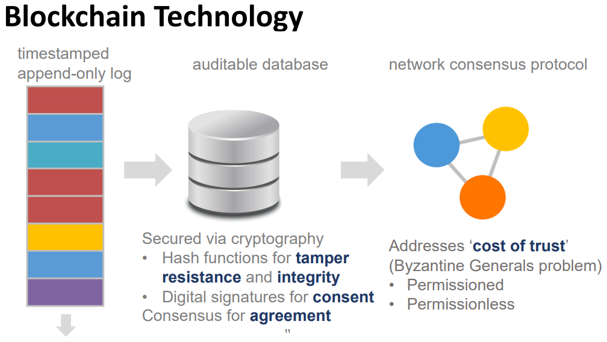

https://www.youtube.com/@mitocw

### Introduction

Role of Finance: Moving, Allocating & Pricing

Financial Sector Issues with Blockchain Technology:

- Performance, Scalability & Efficiency
- Privacy & Security
- Interoperability
- Governance
- Commercial Use Cases

Four Forces - Larry Lessing 'Code and Other Laws of Cyberspace'

- Code/architecture - physical of technical constraints
- Market - economic forces
- Law - explicit mandates by government
- Norms - social conventions

### Money, Ledgers & Bitcoin

Money

- The medium of the transaction
- The unit of count
- The state of value

Non Metal Money

Metal Money

Minted Money

Paper Money

Private Money Notes

inherent value

Scarcity

Ledgers

- Principal Recordings of Accounts:
  - Economic Activity
  - Financial Relationships
- Types of Ledgers:
  - Transaction vs. Balance
  - General vs. Supporting or Sub
  - Single Entry vs. Double Entry

Characteristic of Good Ledgers

- Immutable, Consistency
- Timestamped
- Ownership
- Accuracy
- Description of Transaction
- Comprehensive

Payment Systems

A Method to Amend & Record Changes in Ledgers for Money

Fiat Currency

- Social & Economic Consensus
- Represented by Central Bank Liabilities & Commercial Bank Deposits
- Relies upon System of Ledgers Integrated into Fractional Banking System
- Accepted for Taxes
- Notes & Coins are Legal Tenders for All Debts Public & Private
- Unique Tax Treatment

Characteristics of Money

- Durable
- Portable
- Divisible
- Uniform/Fungible
- Acceptable
- Stable

Design of Money

- Token vs. Account Based
- Physical vs. Digital
- Private Sector vs. Central Bank
- Widely Accessible vs. Wholesale

### Blockchain & Cryptography

**Cryptographic primitive**

The communications and computations that need to be protected or verified and have some form of cryptographic algorithm

- Hash functions
- The whole concept of digital signatures which related to asymmetric cryptography

This content is only supported in a Feishu Docs

**Bitcoin - Technical Features**

- Cryptographic Hash Functions
- Timestamped Append-only Logs(Blocks)
- Block Headers & Merkle Trees
- Asymmetric Cryptography & Digital Signatures
- Addresses

- Consensus through [Proof of Work](https://zh.wikipedia.org/wiki/工作量證明)（[Mining](https://zh.wikipedia.org/zh-hans/挖礦_(數位貨幣)#:~:text=挖矿（英语：Mining）,人通常称为矿工。)）
- Network of Nodes
- Native Currency

- Transaction Inputs & Outputs
- Unspent Transaction Output(UTXO)
- Scripting language

> 挖矿：执行工作量证明，以获取加密货币（消耗CPU的电力和时间来产生比特币）
>
> 穷举法找到一个符合要求的解后，将其打包广播到全网，验证后即可确认该资料块有效
>
> （通过不断更改 nonce 值，对区块头进行 hash 运算，如果结果值小于目标值，则验证通过）
>
> 比特币挖矿是将一段时间内比特币系统中发生的交易进行确认，并记录在区块链上形成新区块的过程，挖矿的人叫做矿工
>
> 挖矿就是记账的过程，矿工是记账员，区块链是账本（分布式账本），并且记账权力也是去中心化的
>
> 成功抢到记账权的矿工，可以获得比特币奖励、以及区块所含交易的交易费（比特币奖励递减、交易数量递增）
>
> 哈希、广播、分布式记账、投票和激励的功能，提高交易记录的篡改成本，让它变得无限可信（https://cloud.tencent.com/developer/news/284087）

 **Cryptographic Hash Functions**

X -> Y  

Y -> X (infeasible, not impossible)  

> The probability that two different inputs have the same hash value is 1*10^(-40)

Hash functions are a way to compress a lot of data, have a fingerprint, make sure that it's basically commitment

**Block Header**

- Version
- Previous Block hash
- Merkle Root hash (get all the transactions in this block)
- Timestamp
- Difficulty target
- Nonce

**Asymmetric Cryptography & Digital Signatures**

- Bitcoin Digital Signature
  - Elliptic Curve Digital Signature Algorithm (FCDSA)

Q: Two different inputs have the same hash value

1*10^(-40)

Q: The timestamp?

More important is the order of blocks in the blockchain

Q: leading zeros?

Q: The order of blocks is different among miners

Q: bitcoin uses a function called the elliptic curve

The secret key is almost a random number, and then the public key is generated along with it(maybe use hash function)

Hedge funds ?

Q: How do the public key and the secret key work?

To encrypt the message: pk for encrypt, sk for decrypt

To sign the message: sk for signature, pk for verification

**Bitcoin Address**

> Can read Nakamoto's emails

Two hash function

**FAQ**

The software is hard to update, needs consensus among the nodes and the operators of the software

Cryptography, consensus mechanism, transactions

### Basic & Consensus

**Bitcoin - Technical Features**

- Cryptography & Timestamped Logs
  - Cryptographic Hash Functions
  - Timestamped Append-only Logs (Blocks)
  - Block Headers & Merkle Trees
  - Asymmetric Cryptography & Digital Signatures
  - Address
- Decentralized Network Consensus
  - Proof of Work
  - Native Currency
  - Network
- Transaction Script & UTXO
  - Transaction Inputs & Outputs
  - Unspent Transaction Outputs (UTXO)
  - Scriting Language

**Cryptographic Hash Functions**

One-Way Data Compression

Examples: the New York Times crossword puzzle   Data commitment

**Timestamped Append-only Logs (Blocks)**

> 区块哈希值：是对区块头的使用 SHA256 算法进行二次哈希产生的值，唯一标识该区块
>
> 仅追加区块 -> 可追溯

**Merkle Tree - Binary Data Tree with Hashes**

> 为了能在区块头体现该区块所有的交易信息，将交易信息使用 Merkle Tree 算法，生成 Merkle Root Hash，并以此作为交易列表的摘要存到区块头中

**Asymmetric Cryptography & Digital Signatures**

Q: Why should we hash out the original data before encryption?

- The original data is so big that it takes more time for digital signature
- Other people who have the public key can also decrypt the digital signature, so they can get the abstract, but they cannot get the original data by the abstract because the hash function is infeasible to reverse

**Bitcoin Address**

More secure and compress it a bit more.

Act as a virtual address to send encrypted currencies.

Never use the same public key twice, creating new public key/private key pairs constantly

https://zhuanlan.zhihu.com/p/28196364

**Decentralized Networks**

Byzantine Generals Problem

- Cannot uniform opinions of people

 Permissionless Blockchains - Unknown participants

- Security based on consensus protocol and native currency

**Hashcash - Proof of Work (Adam Back, 1997)**

Proposed to address E-mail Spam and Denial of Service attacks

- Requires computational work to find a hash within predertermined range
- Difficulty defined by Hash outputs' of leading zeros
- Proof of Work can be Efficiently Verified

 

**Blockchain - Proof of Work**

> 工作量证明：矿工通过 Merkle Tree 算法结合交易列表计算出 Merkle Root Hash，作为输入值部分，区块头还包括 Hash of previous block 以及 timestamp 也将作为输入值，然后矿工通过穷举 nonce 值，使用 SHA256 算法进行哈希运算，将哈希值与目标值进行比较，若小于目标哈希值，则验证通过，就会将区块信息进行广播，让其他节点验证，验证通过才能加入主链中
>
> 目标哈希值是关于 difficulty 的函数，可以动态调整
>
> TargetHash = TargetMax / Difficulty   (TargetMax 是常量）  难度越大，hash 值越小，前导 0 越多

Bitcoin versus Bitcoin Cash

https://zhuanlan.zhihu.com/p/36981528

> 孤块获得的比特币奖励，是无意义的

> 区块链如何防止篡改?
>
> 1. 块链数据结构：因为每个区块都保存着上一个区块的哈希值，所以你改变了一个区块的数据，那么其 hash 值就会改变，所以需要改变该区块后面所有的区块，增大了篡改难度
> 2. PoW（工作量证明）：修改一个区块需要花费一定的算力
> 3. 共识机制：需要其他节验证（半数以上）

CPU：中央处理单元

GPU：图形处理单元

ASIC：专用集成电路（Application Specific Integrated Circuit） 

**Native Currency**

- Fees paid in Gas (10 Gas per ETH) for computation are credited to miners

Attention: **2040 -> 2140**

The small unit of bitcoin：Satoshi

**Network**

- Mempool - Pool of unconfirmed (yet validated) Transactions

**Alternative Consensus Protocols**

 

### Blockchain basics, transactions, UTXO & script code

> https://happypeter.github.io/bitcoin_basics/book/025_how_tx_work.html

**transaction**

Every transaction，in essence, had to go back all the way to  **Coinbase**

Transaction = input + value + output

(Bitcoin: no wallet, only transaction records)

> 交易未确认前甚至可以拿这笔钱花在其他地方
>
> [如何防止”双重支付“](https://xianbao-qian.medium.com/比特币-如何避免双重支出-double-spending-108061e457a3)（UTXO 和 Timestamp，6 确认）
>
> https://www.528btc.com/ask/160447492855553.html

Transaction format:

Input: Previous transaction ID       Index        Signature

Output: Value     Public Key(Bitcoin Address)

lock_time

**Coinbase transaction**

Reward for solving proof of wrok

- Only Input is the Coinbase Block Reward 
- Reward halves (1/2s) every 210,000 blocks 
- Currently 12.5 Bitcoins per block • Originally 50 Bitcoin per block 
- Output may not be used as a Transaction Input until another 100 Blocks 
- Recorded as First Transaction in Merkle Tree 
- May Include 100 bytes of arbitrary data 
  - Used for Additional Nonce 
  - Genesis Block included Headline from Financial Times: ‘The Times 03/Jan/2009 Chancellor on brink of second bailout for banks’ 

**Unspent Transaction Output(UTXO) Set**

Bitcoin transaction outputs that have not been spent at a given time

- Contains All Currently Unspent Transaction Outputs
- Speeds up Transaction Validation Process
- Stored using a LevelDB database in Bitcoin Core called 'chainstate'

**Bitcoin Script**

sed for Transactions

**Bitcoin —— Technical features**

### Smart Contracts and DApps

**Study Questions**

- What are smart contracts? How do they compare to traditional contracts? What are tokens?
- What are smart contract platforms such as Ethereum? What generally distinguishes them from Bitcoin?
- What are decentralized applications (DApps)? What has been the usage and why haven’t any DApps yet received wide consumer adoption? 

**Smart Contracts**

- A set of promises
- Specified in digital form
- Including protocols
- Within which the parties perform on these promises
- May not be Smart, Contracts

**Decentralized Applications (dApps)**

- Applications run on a Decentralized Blockchain Network
- Generally, have a Native Token & Run as a Smart Contract on top of a Platform

**Initial Coin Offerings – Crowdfunding for Investment & Consumption**

- Proceeds used to build networks
- Tokens usually issued prior to being functional
- Development, while open source, is largely centralized
- Promoters allocate themselves ‘premined’ tokens
- Tokens are fungible & transferable
- Scarcity is fostered with preset ‘Monetary policy’
- Purchasers anticipate profits through appreciation

**Conclusions** 

- Nakamoto’s P2P Money Buterin’s Ethereum P2P Computing
- Smart Contracts & DApps Provide:
  - Decentralized Computing & 
  - Self Executing Commitments
- Token Sales for Proposed DApps have Spawned a new form of Crowdfunding – Initial Coin Offerings (ICOs) 
- Amongst 1000’s of Proposals & Offerings, Few DApps have yet Gained Wide Consumer Adoption
- Smart Contracts and DApps, though, have real Potential to bring Change  