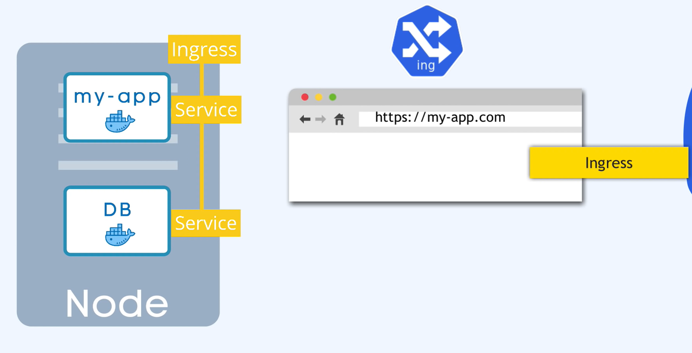

> 官方文档：https://kubernetes.io/docs/home/
>
> 入门视频：https://www.youtube.com/watch?v=s_o8dwzRlu4

Open source container orchestration tool

Helps manage containerized applications in different deployment environments

**Why do we need it?**

- Trend from Monolith to Microservices
- Increased usage of containers
- Demand for a proper way of managing those hundreds of containers


**What features do orchestration tools offer?**

- High Availability or no downtime
- Scalability or high performance
- Disaster recovery - backup and restore


**Control Plane**

- API Server = Entrypoint to K8s cluster
- Controller Manager = keeps track of what's happening in the clus
- Scheduler = ensures Pods placement
- etcd = Kubernetes backing store

Virtual Network = Creates one unified machine


**Control Plane Nodes**

- Handful of master processes
- Much more important


**Worker Nodes**

- Higher workload
- Much bigger and more resources

### Main Kubernetes Components

Pod - abstraction of containers

Service - communication

Ingress - route traffic into cluster

ConfigMap & Secret - external configuration

Volume - data persistence

Deployment & StatefulSet - replication

**Pod**（runs on Node）

> 可以在 Kubernetes 中创建和管理的、最小的可部署的计算单元

- Smallest unit in Kubernetes
- Abstraction over container
- Usually 1 Application per Pod
- Each Pod gets its own IP address
- **New** IP address on re-creation

**Service**

> Even if the pod dies, the service and its ip address will stay

- **Permanent** IP address
- Lifecycle of Pod and Service not connected

You specify the type of Service on creation

Internal Service is the default type.

The request goes first to **ingress** and it does the forwarding then to the service



**ConfigMap & Secret**

ConfigMap: External Configuration of your application

Secret: used to store secret data   reference secret in deployment/Pod

**Volume**

- Storage on local machine
- Or remote, outside of the K8s cluster

Kubernetes doesn't manage data persistence！

**Deployment & StatefulSet**

Deployment = for stateLESS Apps

StatefulSet = for stateFUL Apps or Databases

> Deploying StatefulSet is not easy
>
> DB is often hosted outside of Kubernetes cluster
>
> 容器崩溃后重启会导致数据丢失，所以需要将数据挂载到文件系统中

### Kubernetes Configuration

3 Parts of Configuration file

1. Metadata
2. Specification
3. Status (automatically generated and added by Kubernetes)

Where does K8s get this status data?

Etcd holds the current status of any K8s component

### Minikube & kubectl - Local Setup

> https://minikube.sigs.k8s.io/docs/start/

Minikube is local Kubernetes, focusing on making it easy to learn and develop for Kubernetes.

Multiple Master and Worker nodes

Separate virtual or physical machines

1. Minukube runs as Docker container
2. Docker inside Minikube to run our application containers

Minikube has kuberctl as dependency

Minikube CLI  - for start up/deleting the cluster

Kubectl CLI - for configuring the Minikube cluster 

### Demo Project

**README.md**

K8s manifest files

- mongo-config.yaml
- mongo-secret.yaml
- mongo.yaml
- webapp.yaml

K8s commands

start Minikube and check status

```Plain
minikube start --vm-driver=hyperkit minikube status
```

get minikube node's ip address

```Plain
minikube ip
```

get basic info about k8s components

```Plain
kubectl get nodekubectl get podkubectl get svckubectl get all
```

get extended info about components

```Plain
kubectl get pod -o widekubectl get node -o wide
```

get detailed info about a specific component

```Plain
kubectl describe svc {svc-name}kubectl describe pod {pod-name}
```

get application logs

```Plain
kubectl logs {pod-name}
```

stop your Minikube cluster

```Plain
minikube stop
```

> ⚠ **Known issue - Minikube IP not accessible**

If you can't access the NodePort service webapp with `MinikubeIP:NodePort`, execute the following command:

```Plain
minikube service webapp-service
```

Links

- mongodb image on Docker Hub: https://hub.docker.com/_/mongo
- webapp image on Docker Hub: https://hub.docker.com/repository/docker/nanajanashia/k8s-demo-app
- k8s official documentation: https://kubernetes.io/docs/home/
- webapp code repo: https://gitlab.com/nanuchi/developing-with-docker/-/tree/feature/k8s-in-hour

**mongo-config.yaml**

```YAML
apiVersion: v1
kind: ConfigMap
metadata:
  name: mongo-config
data:
  mongo-url: mongo-service
```

**mongo-secret.yaml**

```YAML
apiVersion: v1
kind: Secret
metadata:
  name: mongo-secret
type: Opaque
data:
  mongo-user: bW9uZ291c2Vy
  mongo-password: bW9uZ29wYXNzd29yZA==
```

**mongo.yaml**

```YAML
apiVersion: apps/v1
kind: Deployment
metadata:
  name: mongo-deployment
  labels:
    app: mongo
spec:
  replicas: 1
  selector:
    # Connecting Deployment to all Pod replicas
    matchLabels:
      app: mongo
  template:
    metadata:
      labels:
        app: mongo
    spec:
      containers:
      - name: mongodb
        image: mongo:5.0
        ports:
        - containerPort: 27017
        env:
        - name: MONGO_INITDB_ROOT_USERNAME
          valueFrom:
            secretKeyRef:
              name: mongo-secret
              key: mongo-user
        - name: MONGO_INITDB_ROOT_PASSWORD
          valueFrom:
            secretKeyRef:
              name: mongo-secret
              key: mongo-password  
---
apiVersion: v1
kind: Service
metadata:
  name: mongo-service
spec:
# select pods to forward the requests to (Connecting Service to Pods)
  selector:
    app: mongo
  ports:
    - protocol: TCP
      port: 27017
      targetPort: 27017
```

**webapp.yaml**

```YAML
apiVersion: apps/v1
kind: Deployment
metadata:
  name: webapp-deployment
  labels:
    app: webapp
spec:
  replicas: 1
  selector:
    matchLabels:
      app: webapp
  template:
    metadata:
      labels:
        app: webapp
    spec:
      containers:
      - name: webapp
        image: nanajanashia/k8s-demo-app:v1.0
        ports:
        - containerPort: 3000
        env:
        - name: USER_NAME
          valueFrom:
            secretKeyRef:
              name: mongo-secret
              key: mongo-user
        - name: USER_PWD
          valueFrom:
            secretKeyRef:
              name: mongo-secret
              key: mongo-password 
        - name: DB_URL
          valueFrom:
            configMapKeyRef:
              name: mongo-config
              key: mongo-url
---
apiVersion: v1
kind: Service
metadata:
  name: webapp-service
spec:
# esposes the Service on each Node's IP at a static port (30000 - 32767)
  type: NodePort
  selector:
    app: webapp
  ports:
    - protocol: TCP
      port: 3000
      targetPort: 3000
      nodePort: 30100
```

> Exposes the Service on each Node's IP at a static port (the `NodePort`). To make the node port available, Kubernetes sets up a cluster IP address, the same as if you had requested a Service of `type: ClusterIP`