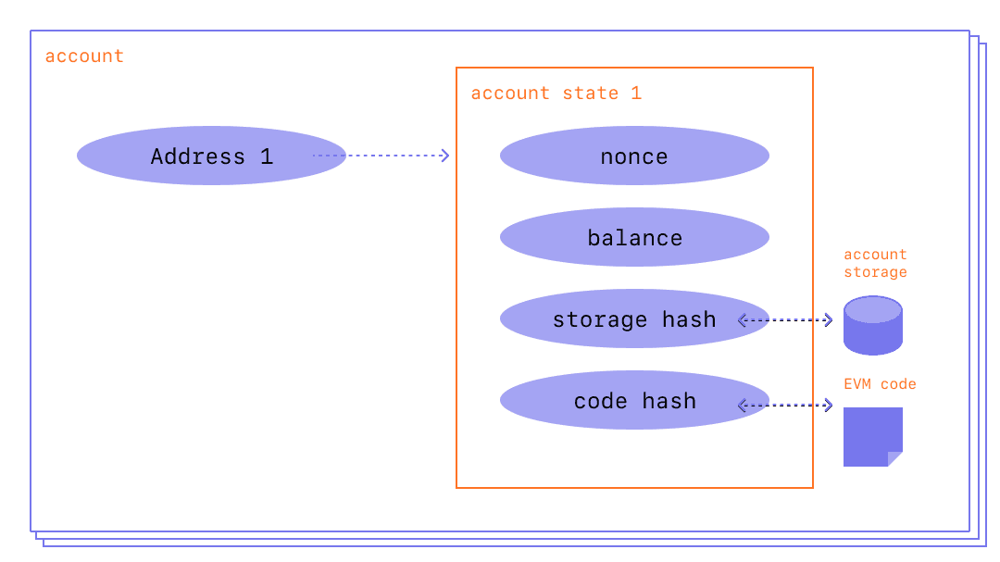

A **blockchain** is a public database that is updated and shared across many computers on a network.

"Block"：data and state

"Chain"：each block cryptographically references its parent

The data in a block cannot change without changing all subsequent blocks, which would require the consensus of the entire network.

> Stake: 抵押
>
> Collateral: 抵押品
>
> Validator: 验证器
>
> Propose: 提议

**Proof-of-stake-based consensus mechanism**

(add new blocks to the chain must stake ETH——as collateral and run validator software)

> A system of rewards and penalties 奖惩制度
>
> Incentivize 激励

**Dapp 和 节点**

- 区块链上可以部署很多 Dapp
- Dapp 通常需要节点来连接到区块链网络

> DApp 是构建在区块链上的应用程序，可以使用智能合约来实现其逻辑和功能，而节点是用于连接和维护区块链网络的计算机。（节点软件：Ethereum Geth）

- 节点维护的是整个区块链网络中所有 DApp 的交易数据

**验证交易**

- 对于权益证明（PoS）算法，验证者（也称为验证节点或共识节点）是通过质押一定数量的加密货币来参与共识过程的。交易通常是由特定的验证者或验证者组来验证的。一些 PoS 区块链允许任何持有加密货币的人成为验证者，而另一些 PoS 区块链则通过特定的验证者选举过程来选择验证者，验证者验证后需要将验证结果广播到网络，如果通过验证，则会将该区块添加到区块链上

> 大多数节点并不是验证节点，他们仅仅是网络中的传输节点，用于接受和转发交易和区块，但也会做基本的验证和处理，并将其广播到整个网络中。

> 验证节点首先会在本地节点检查每个交易，若交易符合协议和规则，则会将其加入到本节点的交易池中，然后会将该交易转发给它所连接的其他节点，直到该交易被打包成一个新的区块（通过 PoS 机制选取矿工节点，开采区块），然后将区块广播给网络中的其他节点，通过共识机制被多数节点验证后，才会将区块加入到本地区块链上（而其他节点在将新区块加入到本地区块链之前，还需要与网络中的其他节点进行同步，以确保整个网络中的区块链是一致的，如果发现区块链分叉 (网络延迟)，节点需要进行共识，选择最长的区块链分支作为主链）

- 在工作量证明（PoW）算法中，矿工需要通过解决一定的密码学难题来验证交易。这些矿工通常是通过算力竞争来获得对交易的验证和确认。具体来说，矿工使用计算机的算力来解决难题，并将结果提交到网络中进行验证。首先解决难题的矿工将获得对交易的验证和确认，并获得一定数量的加密货币作为奖励。

**存储**

在区块链节点中，数据通常存储在一个叫做区块链数据库的数据结构中，每个节点都保存着完整的区块链数据库副本。

区块链数据库通常采用一种叫做“Merkle树”的数据结构来组织和存储数据。Merkle树是一种二叉树结构，其中每个叶子节点包含一个数据块的哈希值，而每个非叶子节点则包含其两个子节点的哈希值的组合哈希值。这种结构可以有效地检查和验证数据的完整性，同时也可以快速地定位和检索数据。

除了区块链数据库之外，一些节点可能还会保存其他数据，例如钱包地址、交易池、挖矿程序等。这些数据通常会存储在节点的内存或磁盘上，以便节点可以快速地处理和响应请求。

> 在以太坊平台中，状态数据库是以 Merkle Patricia Trie 的形式存储的。Merkle Patricia Trie 是一种基于Merkle树的数据结构，它将所有的状态信息存储在一个Trie结构中，Trie结构中的每个节点都包含一个哈希值，用于保证状态信息的安全性和完整性。

具体来说，状态数据库中存储了每个合约地址的存储数据、代码、余额和其他相关信息。

 Merkle Patricia Trie 可以直接存放在内存中，或存放在磁盘中（需要定期从磁盘中加载 Merkle 树来处理请求，可以处理大量数据，但访问速度较慢，可以做缓存、索引来提高访问速度），都需要备份和保护

以太坊平台使用的是 LevelDB 作为状态数据库的存储引擎

EOS平台使用的则是 RocksDB

**Ethereum** is a blockchain with a computer embedded in it.

Decentralized, permissionless, censorship-resistant(抗审查）

Everyone keeps a copy of the state of this computer.

Any participant can broadcast a request -> then other participants on the network verify, validate, and carry out(execute) the computation. The execution causes a state change in the EVM, which is committed and propagated throughout the entire network.

Cryptographic mechanisms

- Tamper proof
- Authentication

> Canonical：典范的
>
> Arbitrary：随意的
>
> Verify: 核实
>
> Validate: 证实
>
> Propagate: 传播
>
> Temper: 篡改
>
> Digital assets: 数字资产

**Ether(ETH)** is the native cryptocurrency of Ethereum.

provide crypto-economic security to the network.

Verify, execute, commit, broadcast ( can be rewarded with ETH)

> Bounty: 赏金
>
> Malicious participants: 恶意参与者
>
> Intentionally clogging: 故意阻塞
>
> resource-intensive scripts: 资源密集型的脚本
>
> call out dishonest behavior by other validators: 指出其他验证者的不诚实行为
>
> Misbehave: 行为不端
>
> Feeding into the fork-choice part of the consensus mechanism: 馈入共识机制的分叉选择部分。

**Smart Contracts**

the programs uploaded to and executed by the network 

> Reusable snippets of code: 可重复使用的代码片段
>
> with varying parameters: 携带不同的参数
>
> A sort of vending machine: 一种自动售货机
>
> Vendor: 小贩
>
> A specific recipient: 一个特殊的收件人
>
> Aggregate: 集合
>
> account balances: 账户余额

Accounts and account balances are stored in a big table in the EVM; they are a part of the overall EVM state.

A "transaction request" is the formal term for a request for code execution on the EVM, and a "transaction" is a fulfilled transaction request and the associated change in the EVM state.

EVM 的状态

在以太坊区块链上，EVM（以太坊虚拟机）的状态（state）是指当前区块链网络中所有合约的存储状态。这个状态是指所有存储在以太坊区块链上的合约数据，包括合约的状态变量和存储的值等。

在EVM中，每个合约都有自己的存储空间，这个存储空间可以通过合约的地址进行访问。在执行以太坊智能合约时，EVM会读取该合约的存储状态，并在执行智能合约的函数时修改该状态。

以太坊区块链的状态存储在区块链的每个节点上，并与网络中的其他节点同步。当一个新的区块被添加到区块链时，它会包含所有合约状态的更新，这些更新会被广播到网络中的其他节点以保持状态同步。由于EVM状态存储在区块链上，所有的合约状态都是不可变的，无法被篡改。

EVM状态是区块链技术的核心之一，它使得以太坊合约的数据不仅能够被存储和读取，还能够被修改，从而为各种去中心化应用程序提供了可靠的基础。

## Ether

**Cryptocurrency**

A medium of exchange secured by a blockchain-based ledger

Ledger: a data store that keeps track of transactions

**Ether (ETH)**

The cryptocurrency that is used for many things on the Ethereum network

They must pay ether to have their transaction recognized on the blockchain.

**Gas fee** depends on

- The amount of computing power required to execute the transaction
- The network-wide demand for computing power at the time

> Fundamentally
>
> Maliciously
>
> block ... from ...
>
> a pricing mechanism

**Minting ether**

Minting is the process in which new ether gets created on the Ethereum ledger. 

Ether is minted 

- as a **reward** for each block proposed and
- at every epoch checkpoint for other validator activity related to reaching consensus.

> staked
>
> remainder 
>
> epoch

**Burning ether**

It means being destroyed.

When ether gets burned, it gets removed from circulation permanently.

Burning **the base fee** hinders a block producers' ability to manipulate transactions.

> estimation 
>
> hinder

**Denominations of ether**

Wei is the smallest possible amount of ether

Gwei, short for giga-wei, is often used to describe gas costs on Ethereum.

> Denominate

**Transferring ether**

a value field

send from the sender's address to the recipient address.

> Sender
>
> recipient

**Querying ether**

Users can query the ether balance of any [account](https://ethereum.org/en/developers/docs/accounts/) by inspecting the account's `balance` field, which shows ether holdings denominated in wei.

[Etherscan](https://etherscan.io/) is a popular tool to inspect address balances via a web-based application.

## DAPP

> A decentralized application (dapp) is an application built on a decentralized network that combines a [smart contract](https://ethereum.org/en/developers/docs/smart-contracts/) and a frontend user interface. On Ethereum, smart contracts are accessible and transparent – like open APIs – so your dapp can even include a smart contract that someone else has written.

**Definition of a Dapp**

A dapp has its backend code running on a decentralized peer-to-peer network.

Furthermore, its frontend can get hosted on decentralized storage such as [IPFS](https://ipfs.io/).

- Decentralized
- Deterministic
- Turing complete
- Isolated

> irrespective
>
> Hamper

**On smart contracts**

> Dapps can be decentralized because they are controlled by the logic written into the contract, not by an individual or company. 

**BENEFITS OF DAPP DEVELOPMENT**

- Zero downtime

> Malicious actors, therefore, cannot launch denial-of-service attacks targeted towards individual dapps.

- Privacy
- Resistance to censorship
- Complete data integrity 

> Immutable and indisputable

- Trustless computation/verifiable behavior

> Predictable
>
> tamper
>
> forge

**DRAWBACKS OF DAPP DEVELOPMENT**

- Maintenance
- Performance overhead
- Network congestion
- User experience
- Centralization

> underlying
>
> balloon

部署 DApp，使用智能合约

如果你部署了一个新的智能合约，其他人可以通过合约地址来访问它并在他们自己的 DApp 中使用它。

首先，你需要将你的智能合约的地址分享给其他人。他们可以使用 Web3.js 或其他的以太坊开发库来连接到以太坊网络并与你的智能合约进行交互。

在他们的 DApp 中，他们可以通过智能合约的地址和 ABI 来创建一个新的合约实例，并调用智能合约中的方法

## Web2 vs Web3

> Monetising
>
> Inherent decentralization
>
> Uncensorable
>
> Gig-economy
>
> Go down
>
> Illustrative 

Web3 limitations

- Scalability
- UX
- Accessibility
- Cost

> The lack of ... makes ... less accessible to ...
>
> Very small portions of ...

Centralization vs Decentralization

https://ethereum.org/en/developers/docs/web2-vs-web3/#centralization-vs-decentralization

> friction
>
> Cut of
>
> Single point of failure
>
> Lower throughout
>
> More total computational resources expended
>
> A protocol is needed for dispute resolution
>
> Make conflicting claims about
>
> In the worst case
>
> Be prone to fracturing
>
> There are many ways to propagate across the network
>
> Gatekeepers 

## Accounts

An Ethereum account is an entity with an ether (ETH) balance that can send transactions on Ethereum.

Two types

- Externally-owned account (EOA) (controlled by anyone with the private keys)
- Contract account (controlled by code)

Both account types have the ability to:

- Receive, hold and send ETH and tokens
- Interact with deployed smart contracts

**Four fields**

- nonce

> A counter that indicates ...
>
> The number of transactions or the number of contracts

- balance

> 1e+18 wei per ETH

- codeHash

> This hash refers to the *code* of an account on the Ethereum virtual machine (EVM).
>
> For externally owned accounts, the codeHash field is the hash of an empty string.
>
> retrieval
>
> corresponding

- storageRoot

> MPT（Merkle Patricia Trie）
>
> Merkle Patricia Tree，梅克尔帕特里夏树，提供了一个基于加密学的，自校验防篡改的数据结构，用来存储键值对关系

**Externally-owned accounts and key pairs**

An account is made up of a cryptographic pair of keys: public and private.

You never really hold cryptocurrency, you hold private keys – the funds are always on Ethereum's ledger.

This prevents malicious actors from broadcasting fake transactions because you can always verify the sender of a transaction.

> It grants you ...
>
> Custody over 
>
> Adversary 

**Account creation**

A private key is made up of 64 hex characters and can be encrypted with a password.

The public key is generated from the private key using the [Elliptic Curve Digital Signature Algorithm](https://wikipedia.org/wiki/Elliptic_Curve_Digital_Signature_Algorithm). 

You get a public address for your account by taking the last 20 bytes of the Keccak-256 hash of the public key and adding `0x` to the beginning.

Others can then take the signature to derive your public key, proving the author of the message.

> Derive ... from
>
> vital

**Contract accounts**

Contract accounts also have a 42 character hexadecimal address.

The contract address is usually given when a contract is deployed to the Ethereum Blockchain. The address comes from the creator's address and the number of transactions sent from that address (the “nonce”).

**Validator keys**

Proof-of-stake

These keys can be efficiently aggregated to reduce the bandwidth required for the network to come to consensus.

**An account is not a wallet**

An account is the keypair for a user-owned Ethereum account.

A wallet is an interface or application that lets you interact with your Ethereum account.

ETH Build

## Transactions

Transactions are cryptographically signed instructions from accounts. 

An account will initiate a transaction to update the state of the Ethereum network.

It refers to an action initiated by an **externally-owned account.**

> prerequisite
>
> debited：贷记
>
> credited：借记
>
> elsewhere

A submitted transaction includes the following information:

- from
- recipient
- signature
- nonce (a sequentially incrementing counter which indicates the transaction number from the account)
- value
- data
- gasLimit
- maxPriorityFeePerGas
- maxFeePerGas

> 如何验证签名：
>
> 1. 根据交易的 hash 和签名信息，使用 erecover 函数派生出公钥
> 2. 然后根据公钥派生出地址
> 3. 检查派生的地址和期望的地址是否相同

An Ethereum client like Geth will handle this signing process.

**Type of transactions**

- Regular transactions
- Contract deployment transactions
- Execution of a contract

**Transaction lifecycle**

Once the transaction has been submitted the following happens:

1. A transaction hash is cryptographically generated: `0x97d99bc7729211111a21b12c933c949d4f31684f1d6954ff477d0477538ff017`
2. The transaction is then broadcasted to the network and added to a transaction pool consisting of all other pending network transactions.
3. A validator must pick your transaction and include it in a block in order to verify the transaction and consider it "successful".
4. As time passes the block containing your transaction will be upgraded to "justified" then "finalized". These upgrades make it much more certain that your transaction was successful and will never be altered. Once a block is "finalized" it could only ever be changed by a network level attack that would cost many billions of dollars.

**Todo**: A visual demo

> Envelope

## Blocks

Blocks are batches of transactions with a hash of the previous block in the chain.

> Be cryptographic derived from ...
>
> Fraud 欺诈
>
> Invalidate 无效
>
> Subsequent

**Why blocks?**

Once every twelve seconds

> Precise
>
> Batch transactions into blocks
>
> Dozens of ...
>
> Space out ...

**How blocks work?**

Blocks are strictly ordered, and transactions within blocks are strictly ordered as well.

> Except in rare cases
>
> Once
>
> Be propagated to ...

**Proof-of-stake protocol**

Proof-of-stake means the following:

- Validating nodes have to stake 32 ETH into a **deposit contract** as collateral against bad behavior. This helps protect the network because provably dishonest activity leads to some or all of that stake being destroyed.
- In every slot (spaced twelve seconds apart) a validator is randomly selected to be the block proposer. They bundle transactions together, execute them and determine a new 'state'. They wrap this information into a block and pass it around to other validators.
- Other validators who hear about the new block re-execute the transactions to ensure they agree with the proposed change to the global state. Assuming the block is valid, they add it to their own database.
- If a validator hears about two conflicting blocks for the same slot they use their **fork-choice algorithm** to pick the one supported by the most staked ETH.

> Collateral
>
> provably
>
> Wrap this information into a block and pass it around to other validators

**What's in a block?**

All clients re-execute the transactions in the `execution_payload` to ensure the new state matches that in the new block `state_root` field

> Attestations
>
> aggregation
>
> valid
>
> Identical

**Block Time**

Block time refers to the time separating blocks.

This implementation differs from proof-of-work based system where block times are probabilistic and tuned by the protocol's target mining difficulty.

> Divided up into
>
> 'slots': twelve second units
>
> occasionally
>
> Differ from
>
> Inferred
>
> On the consistency of the new 12s block time

**Block Size**

A final important note is that blocks themselves are bounded in size.

> Performant full nodes
>
> Capping block sizes

## Ethereum virtual machine (EVM)

It's the environment in which all Ethereum accounts and smart contracts live.

At any given block in the chain, Ethereum has one and only one 'canonical' state,

and the EVM is what defines the rules for computing a new valid state from block to block

> instantiation
>
> Solely
>
> Continuous
>
> Uninterrupted
>
> Immutable
>
> Canonical 典范

**From ledger to state machine**

Ethereum is a distributed state machine.

> analogy
>
> Adhere to a set of rules
>
> Modify 
>
> Underpin
>
> intuitive
>
> sophisticated

**The ethereum state transition function**

State, a modified Merkle Patricia Trie

> reducible

## Gas

It refers to the fee required to execute a transaction on Ethereum.

> Regardless of 
>
> Be denoted in ...
>
> deducted
>
> Initiatives
>
> Eligible
>
> explicitly

**Why do gas fees exist?**

Gas fees help keep the Ethereum network secure.

> Hostile infinite loops

**What is gas limit?**

It refers to the maximum amount of gas you are willing to consume on a transaction.

**Why can gas fees get so high?**

High gas fees are due to the popularity of Ethereum.

> outbid

## Consensus mechanism

### Proof-of-work

### Proof-of-stake

## Smart contract

A "smart contract" is simply a program that runs on the Ethereum blockchain. It's a collection of code (its functions) and data (its state) that resides at a specific address on the Ethereum blockchain.

- A digital vending machine
- Permissionless
- Composability
- Limitations

> metaphor

### **Languages**

- Solidity
- Vyper
- Yul and Yul

### **Anatomy**

**Data**

- Storage
- Memory
- Environment variables

> keep track of
>
> hexadecimal
>
> In addition to

**Function**

- Internal --- these don't create an EVM call
- External --- these do create an EVM call
- Public --- can be called internally from within the contract or externally via messages
- Private --- are only visible for the contract they are defined in and not in derived contracts

View functions

These functions promise not to modify the state of the contract's data.

Constructor funcitons

Are only executed once when the contract is first deployed.

Built-in function

> address.send()

**Writing functions**

Your function needs:

- parameter variable and type (if it accepts parameters)
- declaration of internal/external
- declaration of pure/view/payable
- returns type (if it returns a value)

**Events and Logs**

Events let you communicate with your smart contract from your frontend or other subscribing applications. When a transaction is mined, smart contracts can emit events and write logs to the blockchain that the frontend can then process.

### Library

There are many open source smart contract libraries available that provide reusable building blocks for your project that can save you from having to reinvent the wheel.

What's in a library?

- Reusable behaviors you can add to your contracts
- Implementations of various standards

### Testing smart contracts

**Automated Testing**

1. Functional testing
   1. Unit test
   2. Integration testing
   3. System testing
2. Static/dynamic analysis
   1. Static analysis
   2. Dynamic analysis

**Manual Testing**

- Code audits
- Bug bounties

### **Compiling smart contracts**

> You need to compile your contract so that your web app and the Ethereum virtual machine (EVM) can understand it.

The compiler will also produce the **Application Binary Interface (ABI)** which you need in order for your application to understand the contract and call the contract's functions.

The ABI is a JSON file that describes **the deployed contract and its smart contract functions**.

A JavaScript client library will read the ABI in order for you to call on your smart contract in your web app's interface.

### Deploying smart contracts

> You need to deploy your smart contract for it to be available to users of an Ethereum network.

**What you'll need**

- your contract's bytecode – this is generated through [compilation](https://ethereum.org/en/developers/docs/smart-contracts/compiling/)
- ETH for gas – you'll set your gas limit like other transactions, so be aware that contract deployment needs a lot more gas than a simple ETH transfer
- a deployment script or plugin
- access to an [Ethereum node](https://ethereum.org/en/developers/docs/nodes-and-clients/), either by running your own, connecting to a public node, or via an API key using a [node service](https://ethereum.org/en/developers/docs/nodes-and-clients/nodes-as-a-service/) like [Infura](https://www.infura.io/) or [Alchemy](https://docs.alchemy.com/).

### Verifying smart contracts

Verifying a smart contract basically involves the following steps:

1. Input the source files and compilation settings to a compiler.
2. Compiler outputs the bytecode of the contract
3. Get the bytecode of the deployed contract at a given address
4. Compare the deployed bytecode with the recompiled bytecode. If the codes match, the contract gets verified with the given source code and compilation settings.
5. Additionally, if the metadata hashes at the end of the bytecode match, it will be a full match.

Tools

- Etherscan
- Sourcify
- Tenderly

### Upgrading smart contracts

A smart contract upgrade involves changing the business logic of a smart contract while preserving the contract's state. 

It is important to clarify that upgradeability and mutability are not the same, especially in the context of smart contracts

> Upgradeability
>
> Mutability

1. Creating multiple versions of a smart contract and migrating state (i.e., data) from the old contract to a new instance of the contract.
2. Creating separate contracts to store business logic and state.
3. Using proxy patterns to delegate function calls from an immutable proxy contract to a modifiable logic contract.
4. Creating an immutable main contract that interfaces with and relies on flexible satellite contracts to execute specific functions.
5. Using the diamond pattern to delegate function calls from a proxy contract to logic contracts.

### Smart contracts security

### Smart contracts formal verification

It is one of the recommended techniques for improving smart contract security.

## Token Standard

> Ensure smart contracts remain composable.
>
> When a new project issues a token, it remains compatible with existing decentralized exchanges.
>
> A token is a representation of something in the blockchain.

### ERC-20

> Fungible Tokens 

The ERC-20 introduces a standard for Fungible Tokens, in other words, they have a property that makes each Token be exactly the same (in type and value) as another Token.

Ethereum request for comments 20 is a Token Standard that implements an API for tokens within Smart Contracts.

If a Smart Contract implements the following **methods** and **events**, it can be called an ERC-20 Token Contract. Once deployed it, it will be responsible to keep track of the created tokens on Ethereum.

***Fungible goods*** are equivalent and interchangeable, like Ether, fiat currencies, and voting rights. (how much)

***Non-fungible*** **goods** are unique and distinct, like deeds of ownership, or collectibles. (which ones)

> In a nutshell
>
> [EIP-20: ERC-20 Token Standard](https://eips.ethereum.org/EIPS/eip-20)
>
> [OpenZeppelin - Tokens](https://docs.openzeppelin.com/contracts/3.x/tokens#ERC20)
>
> [OpenZeppelin - ERC-20 Implementation](https://github.com/OpenZeppelin/openzeppelin-contracts/blob/master/contracts/token/ERC20/ERC20.sol)

**decimals**

Decimals is only used for display purposes.

All arithmetic inside the contract is still performed on integers.

**Preset ERC20 contract**

ERC20PresetMinterPauser

It's preset to allow for token minting (create), stop all token transfers (pause) and allow holders to burn (destroy) their tokens.

**Creating ERC20 supply**

- Fixed Supply
- Rewarding Miners
- Modularizing the Mechanism
- Automating the Reward

> A custom supply mechanism
>
> Idiomatic
>
> Showcase ... to
>
> For this purpose that
>
> A widely used implementation of it
>
> aptly
>
> allocated
>
> Ommit
>
> Encapsulating 
>
> Grant the permission to ...

### ERC-721

> Non-Fungible Tokens (NFTs)

A Non-Fungible Token (NFT) is used to identify something or someone in a unique way.

real estate or collectibles

> The total supply of the token available on the network.
>
> functionalities

> Usefulness, rarity
>
> underlying

**Preset ERC721 contract**

ERC721PresetMinterPauserAutoId

It's preset to allow for token minting (create) with token ID and URI auto generation, stop all token transfers (pause) and allow holders to burn (destroy) their tokens.

Access Control

To restrict what accounts can mint items.

### ERC-777

It's difficult to implement properly, due to its susceptibility to different forms of attacks.

It's a fungible token standard improving the existing ERC-20 standard.

Some improvements:

- Hooks
- Decimals
- Backwards compatibility with ERC-20

A hook is simply a function in a contract that is called when tokens are sent to it, meaning accounts and contracts can react to receiving tokens.

### ERC-1155

ERC1155 is a novel token standard that aims to take the best from previous standards to create a **[fungibility-agnostic](https://docs.openzeppelin.com/contracts/4.x/tokens#different-kinds-of-tokens)** and **gas-efficient** [token contract](https://docs.openzeppelin.com/contracts/4.x/tokens#but_first_coffee_a_primer_on_token_contracts).

Functions and features:

- Batch transfer
- Batch Balance
- Batch Approval
- Hooks
- NFT Support
- Safe Transfer Rules