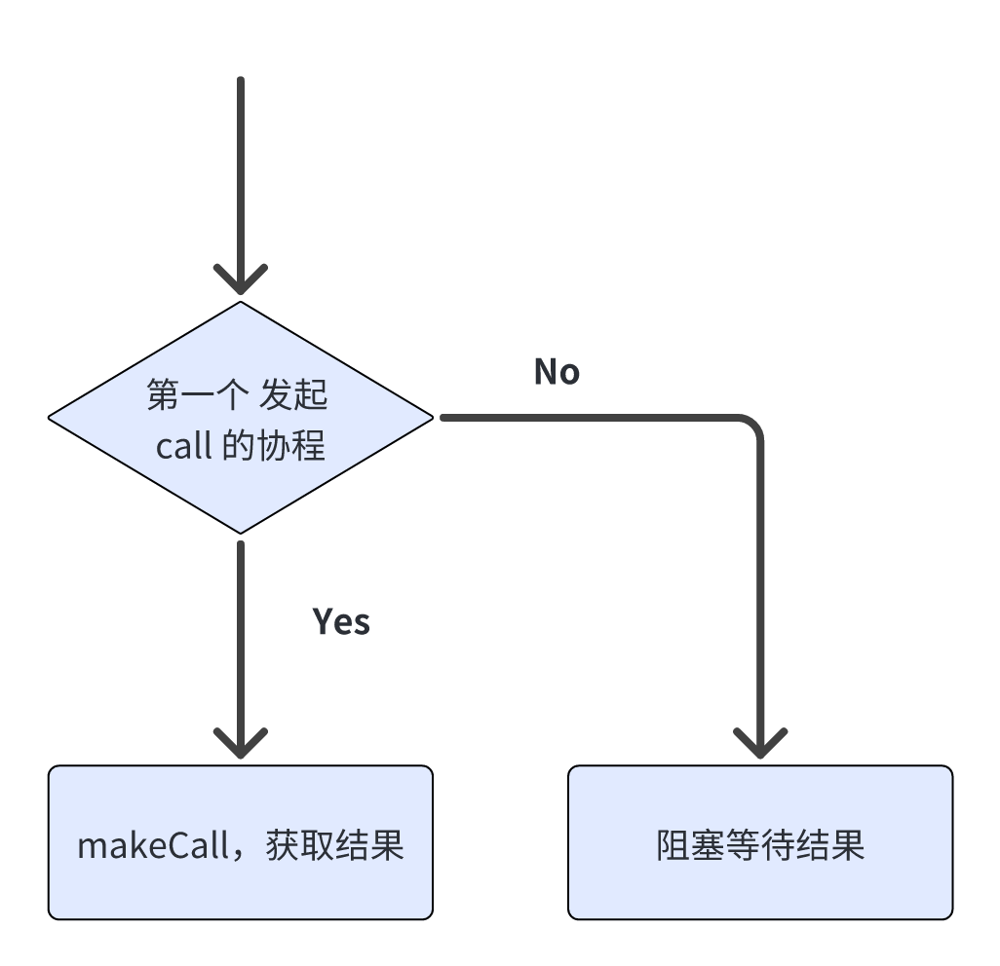

## 应用场景

缓存击穿是在使用缓存过程中常碰到的问题，主要是在高并发的场景下，大量的请求同时查询同一个 key，而这个 key 正好过期失效了，那么大量的请求将直接打到数据库，导致数据库的连接增多，负载上升，随时可能崩溃。

为了解决这个问题，可以采用 singleflight 模式，将请求同一个 key 的多个并发请求合并成一个请求，只让其中一个请求到达数据库，其它请求共享这个结果，以减小数据库的压力。

## 源码分析

先看结构体定义
```Go
type (
        // SingleFlight lets the concurrent calls with the same key to share the call result.
        // For example, A called F, before it's done, B called F. Then B would not execute F,
        // and shared the result returned by F which called by A.
        // The calls with the same key are dependent, concurrent calls share the returned values.
        // A ------->calls F with key<------------------->returns val
        // B --------------------->calls F with key------>returns val
        SingleFlight interface {
                Do(key string, fn func() (any, error)) (any, error)
                DoEx(key string, fn func() (any, error)) (any, bool, error)
        }

        // call 结构
        call struct {
                // 实现协程的等待
                wg  sync.WaitGroup
                // call 操作的返回结果
                val any
                // call 操作发生的错误
                err error
        }

        // 主要结构，实现 SingleFlight 接口
        flightGroup struct {
                // 保存将要执行的 call
                calls map[string]*call
                // 加锁访问 map（map 线程不安全）
                lock  sync.Mutex
        }
)
```

接下来看 Do 方法
```Go
func (g *flightGroup) Do(key string, fn func() (any, error)) (any, error) {
        c, done := g.createCall(key)
        if done {
                return c.val, c.err
        }

        g.makeCall(c, key, fn)
        return c.val, c.err
}
```

在 `g.createCall()` 中判断是否为对应 key 的第一个 call，若是则创建新的 call，将在 `g.makeCall()` 中真正发起请求，即调用 `fn()`，最终返回结果，否则，当前 call 会阻塞，等待对应的 call 返回结果。



接下来看 `g.createCall()`
```Go
// 判断是第一个请求的协程（利用 map）
// 阻塞住其他所有协程（利用 sync.WaitGroup）
func (g *flightGroup) createCall(key string) (c *call, done bool) {
        // lock
        g.lock.Lock()
        // if there are concurrent requests with the same key
        if c, ok := g.calls[key]; ok {
                // unlock
                g.lock.Unlock()
                // wait
                c.wg.Wait()
                return c, true
        }
        
        // new call
        c = new(call)
        // add 1 for wait
        c.wg.Add(1)
        g.calls[key] = c
        g.lock.Unlock()

        return c, false
}
```

再看 `g.makeCall()`
```Go
// 删除 map 中的 key，使得下次发起请求可以获取新的值。
// 调用 wg.Done()，让之前阻塞的协程全部获得结果并返回。
func (g *flightGroup) makeCall(c *call, key string, fn func() (any, error)) {
        defer func() {
                g.lock.Lock()
                // delete completed call
                delete(g.calls, key)
                g.lock.Unlock()
                // done
                c.wg.Done()
        }()

        // get value with fn()
        c.val, c.err = fn()
}
```

## 应用方式
```Go
func main() {
	round := 10
	var wg sync.WaitGroup
	barrier := singleflight.NewSingleFlight()
	wg.Add(round)
	for i := 0; i < round; i++ {
		go func() {
			defer wg.Done()
			// 启用10个协程模拟获取缓存操作
			val, err := barrier.Do("get_rand_int", func() (interface{}, error) {
				time.Sleep(time.Second)
				return rand.Int(), nil
			})
			if err != nil {
				fmt.Println(err)
			} else {
				fmt.Println(val)
			}
		}()
	}
	wg.Wait()
}
```