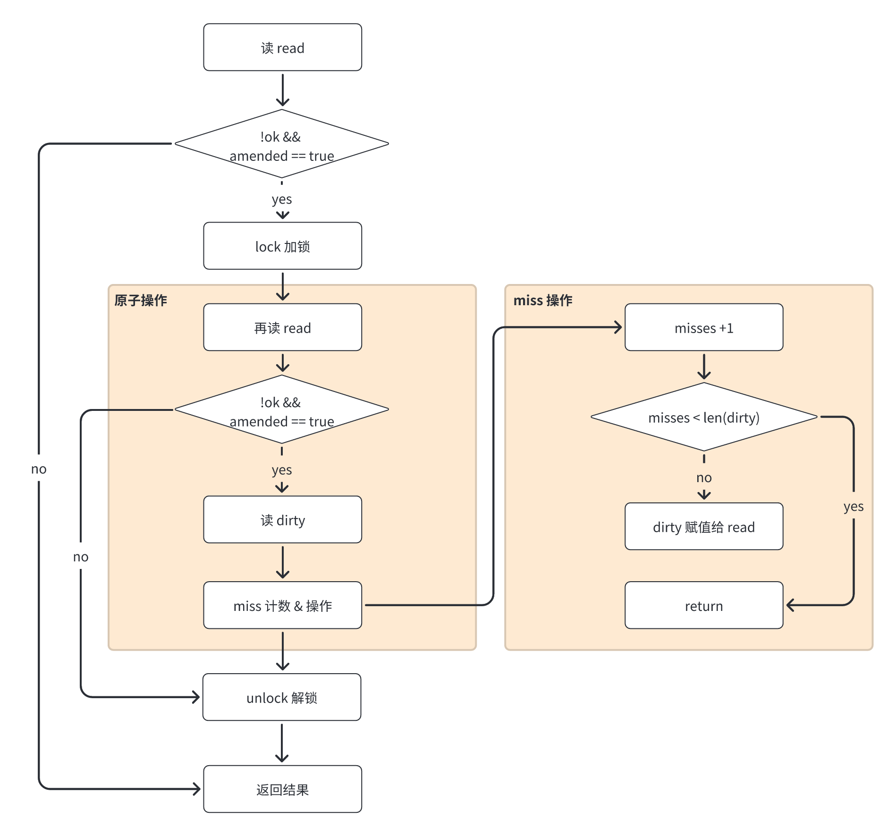
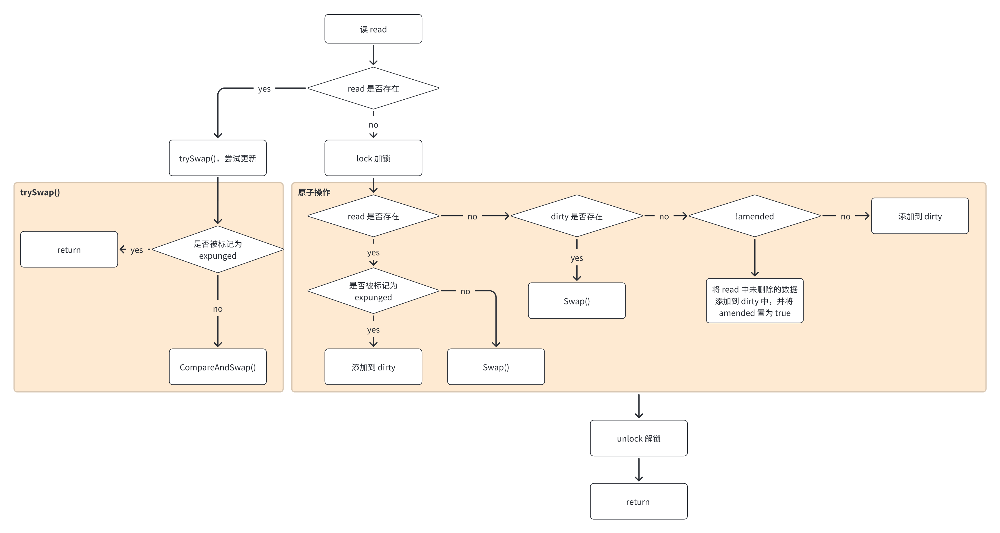
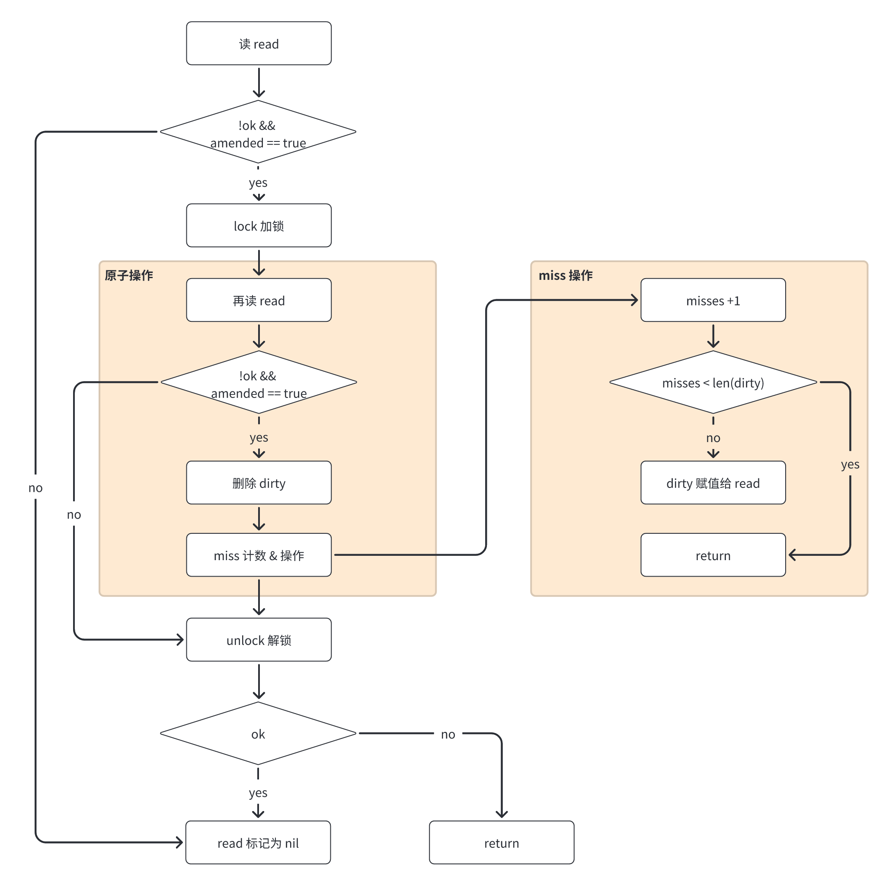

> https://cs.opensource.google/go/go/+/refs/tags/go1.20.6:src/sync/map.go

```Go
type Map struct {
        mu Mutex

        // read contains the portion of the map's contents that are safe for
        // concurrent access (with or without mu held).
        //
        // The read field itself is always safe to load, but must only be stored with
        // mu held.
        //
        // Entries stored in read may be updated concurrently without mu, but updating
        // a previously-expunged entry requires that the entry be copied to the dirty
        // map and unexpunged with mu held.
        read atomic.Pointer[readOnly]

        // dirty contains the portion of the map's contents that require mu to be
        // held. To ensure that the dirty map can be promoted to the read map quickly,
        // it also includes all of the non-expunged entries in the read map.
        //
        // Expunged entries are not stored in the dirty map. An expunged entry in the
        // clean map must be unexpunged and added to the dirty map before a new value
        // can be stored to it.
        //
        // If the dirty map is nil, the next write to the map will initialize it by
        // making a shallow copy of the clean map, omitting stale entries.
        dirty map[any]*entry

        // misses counts the number of loads since the read map was last updated that
        // needed to lock mu to determine whether the key was present.
        //
        // Once enough misses have occurred to cover the cost of copying the dirty
        // map, the dirty map will be promoted to the read map (in the unamended
        // state) and the next store to the map will make a new dirty copy.
        misses int
}

// readOnly is an immutable struct stored atomically in the Map.read field.
type readOnly struct {
        m       map[any]*entry
        amended bool // true if the dirty map contains some key not in m.
}

// expunged is an arbitrary pointer that marks entries which have been deleted
// from the dirty map.
var expunged = new(any)

// An entry is a slot in the map corresponding to a particular key.
type entry struct {
        // p points to the interface{} value stored for the entry.
        //
        // If p == nil, the entry has been deleted, and either m.dirty == nil or
        // m.dirty[key] is e.
        //
        // If p == expunged, the entry has been deleted, m.dirty != nil, and the entry
        // is missing from m.dirty.
        //
        // Otherwise, the entry is valid and recorded in m.read.m[key] and, if m.dirty
        // != nil, in m.dirty[key].
        //
        // An entry can be deleted by atomic replacement with nil: when m.dirty is
        // next created, it will atomically replace nil with expunged and leave
        // m.dirty[key] unset.
        //
        // An entry's associated value can be updated by atomic replacement, provided
        // p != expunged. If p == expunged, an entry's associated value can be updated
        // only after first setting m.dirty[key] = e so that lookups using the dirty
        // map find the entry.
        p atomic.Pointer[any]
}
```


## Load：查询

```Go
// Load returns the value stored in the map for a key, or nil if no
// value is present.
// The ok result indicates whether value was found in the map.
func (m *Map) Load(key any) (value any, ok bool) {
        read := m.loadReadOnly()
        e, ok := read.m[key]
        if !ok && read.amended {
                m.mu.Lock()
                // Avoid reporting a spurious miss if m.dirty got promoted while we were
                // blocked on m.mu. (If further loads of the same key will not miss, it's
                // not worth copying the dirty map for this key.)
                read = m.loadReadOnly()
                e, ok = read.m[key]
                if !ok && read.amended {
                        e, ok = m.dirty[key]
                        // Regardless of whether the entry was present, record a miss: this key
                        // will take the slow path until the dirty map is promoted to the read
                        // map.
                        m.missLocked()
                }
                m.mu.Unlock()
        }
        if !ok {
                return nil, false
        }
        return e.load()
}
func (m *Map) loadReadOnly() readOnly {
        if p := m.read.Load(); p != nil {
                return *p
        }
        return readOnly{}
}
func (m *Map) missLocked() {
        m.misses++
        if m.misses < len(m.dirty) {
                return
        }
        m.read.Store(&readOnly{m: m.dirty})
        m.dirty = nil
        m.misses = 0
}
```

Load 流程：

1. 读取时先从 read 中读取，若不存在且 amended 为 true 时，则加锁，再次读取 read。

> 为什么要再次读取 read 呢？因为前面的判断不是原子操作，可能当时 dirty 正在晋升为 read，避免虚假的 miss，所以需要加锁再次读取 read。也是为了避免不值得的 dirty 拷贝，提高效率

1. 若再次读取也不存在且 amended 为 true，则从 dirty 中获取。
2. 无论 dirty 中是否存在，都需要记录这个 miss，增加 misses 字段，若长度大于等于 dirty 的长度，则将 dirty 赋值给 read，并将 dirty 和 missed 置空




## Store：新增/修改

```Go
// Store sets the value for a key.
func (m *Map) Store(key, value any) {
        _, _ = m.Swap(key, value)
}

// Swap swaps the value for a key and returns the previous value if any.
// The loaded result reports whether the key was present.
func (m *Map) Swap(key, value any) (previous any, loaded bool) {
        read := m.loadReadOnly()
        if e, ok := read.m[key]; ok {
                if v, ok := e.trySwap(&value); ok {
                        if v == nil {
                                return nil, false
                        }
                        return *v, true
                }
        }

        m.mu.Lock()
        read = m.loadReadOnly()
        if e, ok := read.m[key]; ok {
                if e.unexpungeLocked() {
                        // The entry was previously expunged, which implies that there is a
                        // non-nil dirty map and this entry is not in it.
                        m.dirty[key] = e
                }
                if v := e.swapLocked(&value); v != nil {
                        loaded = true
                        previous = *v
                }
        } else if e, ok := m.dirty[key]; ok {
                if v := e.swapLocked(&value); v != nil {
                        loaded = true
                        previous = *v
                }
        } else {
                if !read.amended {
                        // We're adding the first new key to the dirty map.
                        // Make sure it is allocated and mark the read-only map as incomplete.
                        m.dirtyLocked()
                        m.read.Store(&readOnly{m: read.m, amended: true})
                }
                m.dirty[key] = newEntry(value)
        }
        m.mu.Unlock()
        return previous, loaded
}

// trySwap swaps a value if the entry has not been expunged.
//
// If the entry is expunged, trySwap returns false and leaves the entry
// unchanged.
func (e *entry) trySwap(i *any) (*any, bool) {
        for {
                p := e.p.Load()
                if p == expunged {
                        return nil, false
                }
                if e.p.CompareAndSwap(p, i) {
                        return p, true
                }
        }
}

// CompareAndSwap swaps the old and new values for key
// if the value stored in the map is equal to old.
// The old value must be of a comparable type.
func (m *Map) CompareAndSwap(key, old, new any) bool {
        read := m.loadReadOnly()
        if e, ok := read.m[key]; ok {
                return e.tryCompareAndSwap(old, new)
        } else if !read.amended {
                return false // No existing value for key.
        }

        m.mu.Lock()
        defer m.mu.Unlock()
        read = m.loadReadOnly()
        swapped := false
        if e, ok := read.m[key]; ok {
                swapped = e.tryCompareAndSwap(old, new)
        } else if e, ok := m.dirty[key]; ok {
                swapped = e.tryCompareAndSwap(old, new)
                // We needed to lock mu in order to load the entry for key,
                // and the operation didn't change the set of keys in the map
                // (so it would be made more efficient by promoting the dirty
                // map to read-only).
                // Count it as a miss so that we will eventually switch to the
                // more efficient steady state.
                m.missLocked()
        }
        return swapped
}

// tryCompareAndSwap compare the entry with the given old value and swaps
// it with a new value if the entry is equal to the old value, and the entry
// has not been expunged.
//
// If the entry is expunged, tryCompareAndSwap returns false and leaves
// the entry unchanged.
func (e *entry) tryCompareAndSwap(old, new any) bool {
        p := e.p.Load()
        if p == nil || p == expunged || *p != old {
                return false
        }

        // Copy the interface after the first load to make this method more amenable
        // to escape analysis: if the comparison fails from the start, we shouldn't
        // bother heap-allocating an interface value to store.
        nc := new
        for {
                if e.p.CompareAndSwap(p, &nc) {
                        return true
                }
                p = e.p.Load()
                if p == nil || p == expunged || *p != old {
                        return false
                }
        }
}

// unexpungeLocked ensures that the entry is not marked as expunged.
//
// If the entry was previously expunged, it must be added to the dirty map
// before m.mu is unlocked.
func (e *entry) unexpungeLocked() (wasExpunged bool) {
        return e.p.CompareAndSwap(expunged, nil)
}

// swapLocked unconditionally swaps a value into the entry.
//
// The entry must be known not to be expunged.
func (e *entry) swapLocked(i *any) *any {
        return e.p.Swap(i)
}

// 将 read 中未删除的数据加入到 dirty 中
func (m *Map) dirtyLocked() {
        if m.dirty != nil {
                return
        }

        read := m.loadReadOnly()
        m.dirty = make(map[any]*entry, len(read.m))
        
        // 遍历 read
        for k, e := range read.m {
                // 通过此次操作，dirty 中的元素都是未被删除的，可见标记为 expunged 的元素不在 dirty 中！！！
                if !e.tryExpungeLocked() {
                        m.dirty[k] = e
                }
        }
}

// 判断 entry 是否被标记删除，并且将标记为 nil 的 entry 更新标记为 expunged
func (e *entry) tryExpungeLocked() (isExpunged bool) {
        p := e.p.Load()
        for p == nil {
                if e.p.CompareAndSwap(nil, expunged) {
                        return true
                }
                p = e.p.Load()
        }
        return p == expunged
}
```

Store 流程：

1. 若 read 中存在该值，则尝试更新：若该值未被标记 expunged，则进行 CompareAndSwap
2. 若不存在，则加锁再次判断是否存在，若 read 中存在：
   1. 则通过 e.unexpungeLocked() 判断其是否被标记为 expunged，若是，则将其添加到 dirty 中（因为它被标记为 expunged，说明在 dirty 中不存在）
   2. 若不是，则再次进行 Swap()，尝试更新
3. 若 read 中不存在，则判断 drity 中是否存在，若 drity 中存在：
   1. 则再次进行 Swap()，尝试更新
4. 若 drity 中也不存在：
   1. 若 dirty 不包含 read 中不存在的 key，则触发一次 dirty 刷新，将 read 中未删除的数据加入到 dirty 中，（因为当 read 重置的时候，dirty 已经置为 nil 了）在这个过程中还将标记为 nil 的 entry 更新标记为 expunged
   2. 若 dirty 中包含 read 中不存在的 key，则将新的键值对写入 dirty 中




## Delete：删除

```Go
// Delete deletes the value for a key.
func (m *Map) Delete(key any) {
        m.LoadAndDelete(key)
}

// LoadAndDelete deletes the value for a key, returning the previous value if any.
// The loaded result reports whether the key was present.
func (m *Map) LoadAndDelete(key any) (value any, loaded bool) {
        read := m.loadReadOnly()
        e, ok := read.m[key]
        if !ok && read.amended {
                m.mu.Lock()
                read = m.loadReadOnly()
                e, ok = read.m[key]
                if !ok && read.amended {
                        e, ok = m.dirty[key]
                        delete(m.dirty, key)
                        // Regardless of whether the entry was present, record a miss: this key
                        // will take the slow path until the dirty map is promoted to the read
                        // map.
                        m.missLocked()
                }
                m.mu.Unlock()
        }
        if ok {
                return e.delete()
        }
        return nil, false
}
```

Delete 流程：

1. 先判断 read 中是否存在，若不存在，则加锁再次判断
2. 再次判断还是不存在，则直接删除 dirty 中的，并记录 miss，进行 m.missLocked()
3. 若 misses 字段 大于等于 drity 的长度，则将 drity 赋值给 read，并将 dirty 和 misses 置空
4. 若 read 中存在该 key，将进行 e.delete()，通过延迟删除对 read 中的值域先进行标记：

将 read 中目标 key 对应的 value 值置为 nil（`e.delete()`→将`read=map[interface{}]*entry`中的值域*entry 置为 nil）




## 总结

sync.Map 是通过冗余的两个数据结构(read、dirty)，实现性能的提升。

1. 为了提升性能，load、delete、store 等操作尽量使用只读的 read；
2. 为了提高 read 的 key 击中概率，采用动态调整，将 dirty 数据提升为 read；
3. 对于数据的删除，采用延迟标记删除法，*只有在提升 dirty 的时候才删除*。
